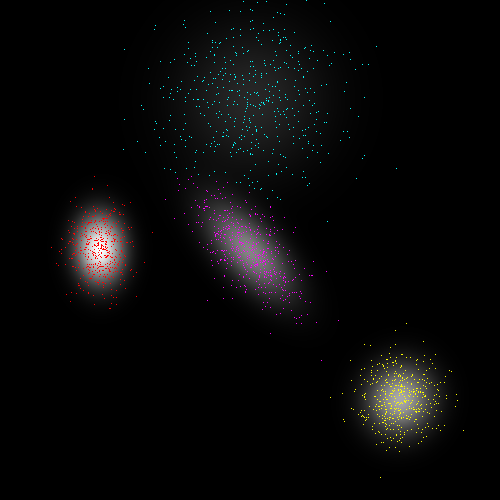

# Overview

This is an implementation of the expectation maximization (EM) algorithm for maximum-likelihood estimation of Gaussian mixture model parameter estimation. It supports data of arbitrary dimensions, and avoids numerical errors in the presence of thin subspaces or degenerate data by clamping the eigenvalues of the covariance matrices via a user-defined threshold.
It is based on the Eigen linear algebra library.

 

## Example Usage
The below snippet initializes a Gaussian mixture model with 3 components in 2 dimensions, with a minimum component variance of 0.01, then optimizes the parameters for 50 random observations and reports the likelihood of a new observation given the learned model.
```c++
GaussianMixture gmm(3, 2, 0.01);
Eigen::MatrixXd data = Eigen::MatrixXd::Random(50, 2);
int iters = gmm.learn(data);
std::cout << "took " << iters << " iterations" << std::endl;
std::cout << "-------- parameters --------" << std::endl << gmm << std::endl;

Eigen::RowVector2d point(0, 0);
std::cout << "log likelihood at point " << point << ": " << gmm.getLogLikelihood(point) << std::endl;
```
# Building instructions
To build the example tests, navigate to the root directory, and run
```
mkdir build
cd build
cmake .. -DCMAKE_BUILD_TYPE=Release
make
```
It is important to build in release mode, since Eigen is much slower in debug mode. The test generates 2D points in a plane according to a mixture of gaussians, then attempts to recover the mixture parameters from the observed samples. It also tests the numerical stability in the presence of thin subspaces and degenerate data.